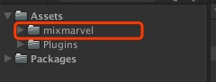
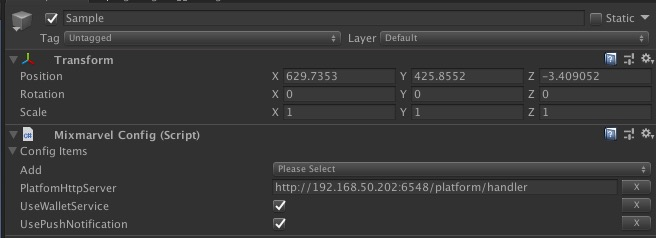
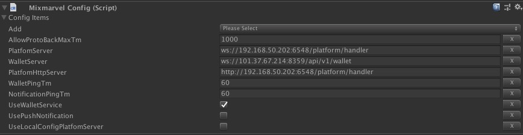

# Mixmarvel SDK 接入文档

更新事件2019-10-10 14:35
对应SDK版本mixmarvel_sdk_20190812_1137.unitypackage

## 0x01 接入前注意事项

1. 由于Mixmarvel SDK存在公共UI系统，UI基于Unity的渲染实现，UI占用层级为Unity的MixmarvelUI层级，请先添加此层级。


## 0x03 接入步骤

### STEP 1
导入获取的mixmarvel sdk for unity的unitypackage包，双击导入。
导入成功后会在`Asset`目录下看到如下`mixmarvel`目录



注意：
1. Mixmarvel SDK内部依赖websocket_sharp（websocket连接）,zxing_untiy(二维码生成)，如果你的项目已经使用过，可以手动mixmarvel目录下的Plugins目录中删除重复使用的dll。


### STEP 2 (此步骤如不需要特殊定制调试可以跳过)

如果需要自定义配置开发服务器等信息，请在启动场景上New一个GameObject，在GameObject上挂载由Mixmarvel SDK提供的Mixmarvel Config组件，组件菜单路径为 `Mixmarvel/Mixmarvel Config`。



1. 点击add item下拉菜单，选择要修改的配置项，下方会自动出现需要配置项的输入。
2. 自行修改对应配置中的值。


### STEP 3
在使用任何Mixmarvel SDK提供的功能接口前请先调用SDK的初始化函数

```C#
MixmarvelSDK.InitSDK(appId);
```


参数appId为平台分配的应用ID,如果不传则使用MixmarvelConfig中配置的AppId

### STEP4

调用SDK登录接口，或者使用SDK提供的登录UI登录

## 0x02 关于Mixmarvel Config

功能Mixmarvel config一般用于生产环境使用，如无特殊需求，可以不挂载配置，默认使用发布环境数据。

下图为全部的配置



| 配置字段 | 功能 | 备注 |
| --- | --- | --- |
| **AppId** | **应用的平台应用**ID | 平台后台分配 |
| AllowProtoBackMaxTm | 协议允许等待返回最大时间 | 服务端断点调试时可能会调高 |
| WalletPingTm | 钱包心跳时间 | 不建议修改 |
| NotificationPingTm | 消息推送心跳时间 | 不建议修改 |
| UseWalletService | 是否使用钱包服务 | 一般不建议关闭 |
| UsePushNotification | 是否使用推送服务 | 如果不需要平台消息推送可以关闭 |
| PlatfomHttpServer | 平台服务器地址 | 开发期根据需要修改 |
| PlatfomServer | 推送服务器地址 | 开发期根据需要修改 |
| WalletHttpServer | 钱包Http服务器地址 | 开发期根据需要修改 |
| WalletServer | 钱包服务器地址 | 开发期根据需要修改 |
| UseLocalConfigPlatfomServer | 是否使用本地配置的推送服务器地址 | 如果不开启将SDK将使用从平台自动获取的地址 |
| UseLocalConfigWalletServer | 是否使用本地配置的钱包服务器地址 | 如果不开启将SDK将使用从平台自动获取的地址 |


**其中平台服务器地址为关键项，其他几个地址，SDK在不配置时会通过平台服务器获取**。目前开放服务器为：

 外网测试服：    https://api-test.mixmarvel.com/platform/handler


